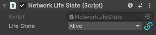

# Unofficial Odin support for Netcode for GameObjects

### How to install

Put 'NetcodeForGameObjectsOdin' in Assets folder

## Netcode for GameObjects

Add editor for NetworhBehaviour that has the same functionality as original but supports Odin drawing.

Add custom drawer for NetworkVariable.

:warning: Attributes with expresions that reference fields, methods or properTies don't work correctly as attributes are passed to inner class field and expresion path now need to go to parent of that value
